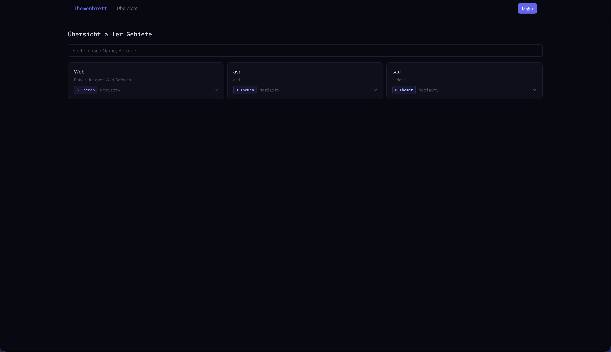
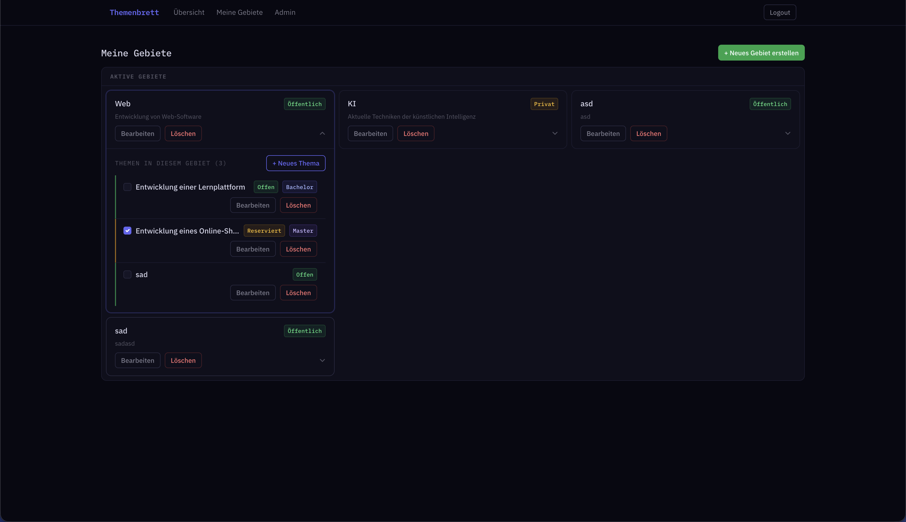
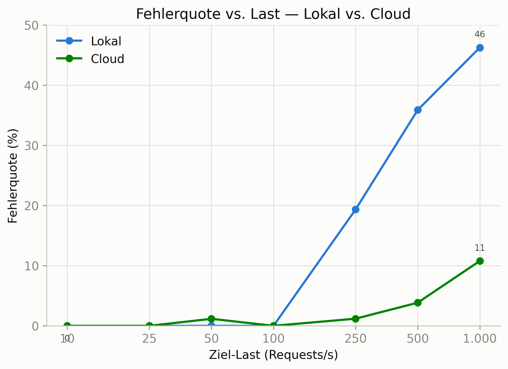
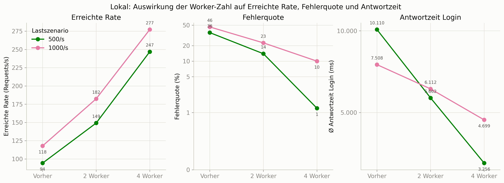

# Themenbrett

**Themenbrett** is a full-stack web application that lets professors publish thesis/project topics ("Themen"), organized by subject area ("Gebiete"), for students to browse. Admins can manage professors and their topics through a dedicated admin area.

This was built as a semester project for a web engineering course at Berliner Hochschule für Technik. The goal was to design and implement a complete web application end-to-end from data modeling and a REST API, through a React frontend, to automated testing, containerization, CI/CD, and a Kubernetes deployment.

**Live demo:** deployed on Oracle Cloud — [marlowpwa.duckdns.org](http://marlowpwa.duckdns.org/)

## Repositories

This project is split across three repositories:

- **Backend** — [pwa_backend](https://github.com/MarlowMix/pwa_backend): Node.js/Express REST API
- **Frontend** — [pwa_frontend](https://github.com/MarlowMix/pwa_frontend): React single-page application
- **Test** — [pwa_test](https://github.com/MarlowMix/pwa_test): Playwright end-to-end test suite

## Screenshots

**Overview of all subject areas** (public, no login required)

**My subject areas** (logged in as a professor, managing topics)

## Load Testing

JMeter load tests uncovered a performance bottleneck in the backend, comparing a local run against the deployment on the university's Kubernetes cluster ("Cloud"). Node clustering (worker processes) fixed it:

At 500 requests/s, adding 4 worker processes cut the error rate from 46% to 1% and the average login response time from 10.1s to 3.3s.

## Tech Stack

**Backend**
- Node.js, Express, TypeScript
- MongoDB with Mongoose
- JWT-based authentication with httpOnly cookies, bcrypt password hashing
- Jest + Supertest for unit/integration tests, with an in-memory MongoDB for CI
- Node cluster/worker setup to improve throughput under load

**Frontend**
- React 19, TypeScript, Vite
- React Router, React Bootstrap
- Vitest + React Testing Library for component tests

**Test**
- Playwright for end-to-end browser testing across the full stack

**Infrastructure & Tooling**
- Docker & Docker Compose for local orchestration of frontend, backend, and MongoDB
- Kubernetes manifests for deployment to a university cluster
- GitHub Actions CI/CD pipelines: linting, tests, Docker image builds published to GHCR, and automated deployment
- Apache JMeter for load testing, used to identify and fix a performance bottleneck (addressed via Node clustering)

## What I learned / applied

- Designing and implementing a REST API with authentication, authorization, and input validation
- Modeling relational-ish data in MongoDB with Mongoose
- Building a React application with client-side routing, shared state, and reusable component patterns
- Writing tests at multiple levels: unit/integration (Jest), component (Vitest + Testing Library), and end-to-end (Playwright)
- Setting up CI/CD pipelines that lint, test, build Docker images, and deploy automatically
- Containerizing and deploying a multi-service application with Docker Compose and Kubernetes
- Load testing with JMeter and diagnosing/fixing a real performance issue under concurrent load
- Secure handling of secrets and environment-specific configuration across local, CI, and production environments

## Running locally

Each repository can be run independently for development (see the respective `package.json` scripts). The full stack (frontend + backend + MongoDB) is intended to run together via Docker Compose, with environment variables supplying secrets such as the JWT signing key and database credentials.
